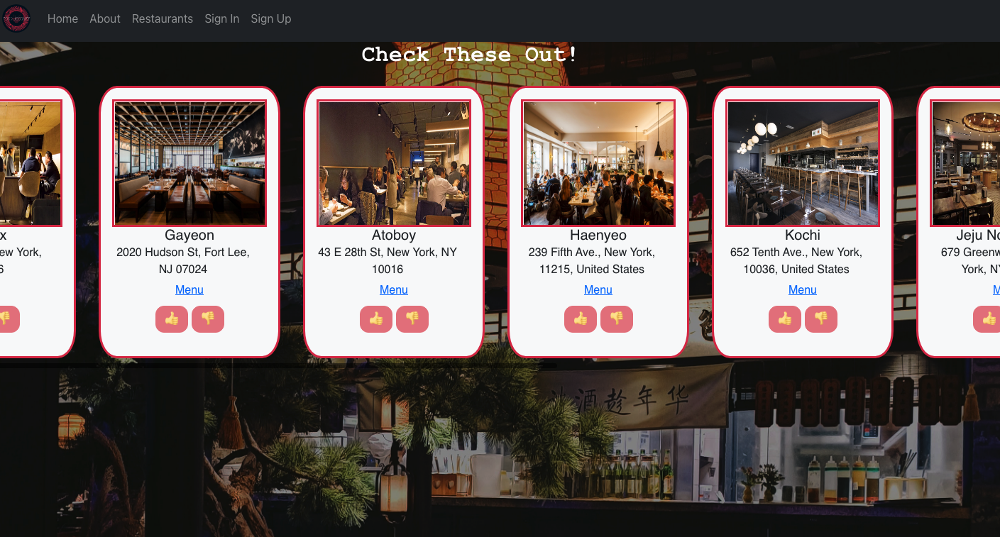

# Food Journey
> Keep a journal of your favorite restaurants! 

## Table of contents
* [General info](#general-info)
* [Project Demo](#project-demo)
* [Project Video](#project-video)
* [Technologies](#technologies)
* [Setup](#setup)
* [Features](#features)
* [Inspiration](#inspiration)
* [Contact](#contact)

## General info
Food Journey is a website that allows you to keep track of the restaurants that you like near your area. This website is specifically tailored to restaurants in the NYC area and can be expanded to other locations. 

<div align="center">Welcome to Food Journey. </div>
<br/>
<div align="center">
<kbd>

</kbd>
</div>

<br/>
<div align="center">
<kbd>

</kbd>
</div>

## Project Demo 
[Click to view site](https://main.d1ghkzohvm8pvi.amplifyapp.com/)

## Project Video
[Click to view demo of Food Journey](https://www.loom.com/share/3727ffeece824b7696cb8c036b1316e5)

## Technologies

### Backend Development 
* AWS Amplify
* GraphQL
### Frontend Development 
* JavaScript
* HTML
* CSS
* React.js
* React-DOM
* React-Router-DOM
* Bootstrap

## Setup
To try out this project: 
1. Clone the GitHub repository locally to your computer
1. In the command line, navigate to the root directory of the repository, and type the following: 
  $ npm install 
1. Navigate to the client folder, and in the root directory of the client folder, type the following: 
  $ npm install 
1. In the client folder, and in the root directory of the client folder, type the following: 
  $ npm start
1. The website will need to be connected to AWS Amplify so that the backend can be set up or it can be updated to work with a db.json file.


## Code Examples
### AWS Amplify Studio
```AWS Amplify
type Restaurant @model @auth(rules: [{allow: public}]) {
  id: ID!
  name: String!
  image: String!
  location: String!
  phone: String
  menulink: String!
}

type User @model @auth(rules: [{allow: public}]) {
  id: ID!
  username: String!
  password: String!
  liked: [ID]
}
```

### JavaScript/React.js 
```React.js
 // when like button gets clicked, clicked data gets sent to this function
  function handleLike(data) {
    // filter all restaurant and return all except for the one that we liked
    const filteredLike = dislikedRes.filter((res) => {
      return res.id !== data.id;
    });

    likedArray = userID[0].liked

    let copyLikedArray = [...likedArray]
    //add the restaurant id to the liked array
    copyLikedArray.push(data.id);

    const updateUserLiked = async () => {
      const original = await DataStore.query(User, userID[0].id)
      let copyOriginal = [...original.liked]
      copyOriginal.push(data.id)
      /* Models in DataStore are immutable. To update a record you must use the copyOf function
      to apply updates to the item’s fields rather than mutating the instance directly */
      await DataStore.save(User.copyOf(original, updated => {
        updated.liked = copyOriginal
      }));
    }

    //updated liked array for the current user
    updateUserLiked()

    let alreadyLiked = allRestaurants.filter((res) => {
      return copyLikedArray.includes(res.id);
    });

    // push the data that we liked to liked restauarant list
    setLikedRes(alreadyLiked);
    // we set all restaurant to show all excepte for the one that we like
    setDislikedRes((dislikedRes) => filteredLike);

  }
```

## Features
* Front-End web application utilizing React and using GraphQL to manipulate a user created API
* Front-End styles and chart components built with Bootstrap and CSS. 
* Users can create an account through application. However, the account creation is not secure. 
* View and like/dislike restaurants that are listed.
* Have your likes and dislikes saved for when you come back.

## Status
Project is finished with option to expand functionality and to optimize the code. Authentication should also be added for user creation.

## Inspiration
The inspiration for Food Journey came for when my partner and I wanted a way to keep track of the restaurants we liked. In addition, we wanted to keep track of the dishes we liked and that is something that can be added to this website. That way, when you go back to a restaurant you've been to, you can get the dish you liked!

## Contact
Created by [Joseph Shin](https://www.linkedin.com/in/joseph-sw-shin/) 
Feel free to contact me for any questions! 
